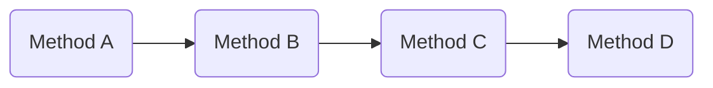
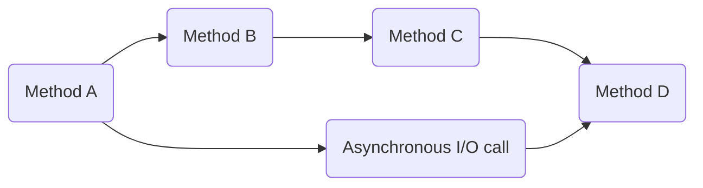
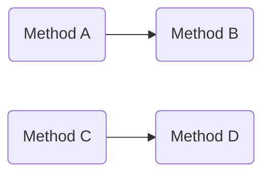

# Writing a multithreaded plugin

The Minecraft server runs game code primarily on a single thread. This is huge limitation as a singular thread can only be so fast.

Luckily, there are server cores that allow the game code to run on multiple threads.
These include [Folia](https://papermc.io/software/folia) and [ShreddedPaper](https://github.com/MultiPaper/ShreddedPaper).
However, a normal Bukkit plugin will not work on these server cores, and needs to be rewritten to have a multithread environment.

## What is a thread?

### Single threaded

A thread is what your code executes on. One thread can execute one piece of code at a time.
This means if your plugin is single-threaded, only one part of the plugin will be executed at a given time.



### Asynchronous calls

When you make an asynchronous call on your single-threaded plugin, a second thread is spawned to execute the call.
This is good for when you want to execute slow I/O tasks without it blocking your primary thread.

With Bukkit, you can create an asynchronous call with `Bukkit.getScheduler().runTaskAsynchronously`.
Some events like `AsyncPlayerPreLoginEvent` run asynchronous by default.



### Multithreaded

When your plugin is multithreaded, it means that there is more than just a single thread executing your code.
This results in many parts of your plugins being executed at the same time as eachother.

Issues will arise if you try to run a single-threaded plugin in a multithreaded environment, and these will be covered below.



## The APIs for multithreaded plugins

There are certain APIs that are specific to multithreaded plugins.
These APIs exist in all recent versions of Paper, however if you want your plugin to be compatible with older versions and Spigot, check out [MultiLib](https://github.com/MultiPaper/MultiLib?tab=readme-ov-file#shreddedpaper--folia-methods).

### plugin.yml

Firstly, in your `plugin.yml`, you will need to tell the server that your plugin is a multithreaded plugin.

Do that by adding `folia-supported: true`:

```yml
name: MyPlugin
version: 1.0.0
main: com.exmaple.MyPlugin
api-version: 1.20
folia-supported: true
```

### Accessing the world

Each thread is only able to access the region of the world that it is in charge of.

First, check if your thread is in charge of that region of world:

```java
Location location = new Location(Bukkit.getWorld("world"), 0, 0, 0);
if (Bukkit.isOwnedByCurrentRegion(location)) {
    // We are in charge of this location! Let's modify the block here
    location.getBlock().setType(Material.AIR);
}
```

Otherwise, if we aren't in charge of that region, we will need to schedule our code to run in that region:

```java
// If we aren't in charge of that location we need to schedule it
Location location = new Location(Bukkit.getWorld("world"), 0, 0, 0);
Bukkit.getRegionScheduler().run(plugin, location, t -> {
    // Now we are in charge of that location! Let's modify the block!
    location.getBlock().setType(Material.AIR);
});
```

We can also do this for entities:

```java
Entity entity = Bukkit.getWorld("world").getEntities().get(0);
if (Bukkit.isOwnedByCurrentRegion(entity)) {
    // We are in charge of this entity! Let's remove it
    entity.remove();
} else {
    // We aren't in charge of that entity, let's schedule it
    entity.getScheduler().run(plugin, t -> {
        // Now we are in charge of that entity! Let's remove it!
        entity.remove();
    }, null);
}
```

### Asynchronous calls

Asynchronous calls can be made with:

```java
Bukkit.getAsyncScheduler().runNow(plugin, t -> {
    // Async code goes here
});
```

### Tips

During most events and commands, you will be on the thread of the player/entity/block that triggered the event or command.

## Java gotchas for multithreaded plugins

### Race conditions

Consider the code below.

```java
Player player;

void nextPlayer() {
    Player nextPlayer = this.getTheNextPlayer(this.player);
    nextPlayer.sendMessage("You are now the player!");
    this.player = nextPlayer;
}
```

If you ran the method `nextPlayer` twice in a single-threaded plugin, you would expect the following to occur:
1. `player` is `PlayerA`
2. Call 1 executes `this.getTheNextPlayer()` and gets the next player `PlayerB`
3. Call 1 sends `PlayerB` the message `"You are now the player!"`
4. Call 1 saves `player` to be `PlayerB`
5. Call 2 now executes `this.getTheNextPlayer()` and gets the next player `PlayerC`
6. Call 2 sends `PlayerC` the message `"You are now the player!"`
7. Call 2 saves `player` to be `PlayerC`

This makes sense. However, if the method `nextPlayer` is running on two threads at the same time, the following will occur:

1. `player` is `PlayerA`
2. Thread 1 executes `this.getTheNextPlayer()` and gets the next player `PlayerB`
3. Thread 2 also executes `this.getTheNextPlayer()`. Since `player` is still `PlayerA`, the next player is still `PlayerB`
4. Thread 1 sends `PlayerB` the message `"You are now the player!"`
5. Thread 2 also sends `PlayerB` the message `"You are now the player!"`
6. Thread 1 saves `player` to be `PlayerB`
7. Thread 2 also saves `player` to be `PlayerB`

This shows the issue of race conditions and why you need to try to avoid them

### Synchronized statement

To avoid race conditions, you may need to make sure your code is only executing on one thread at a time.
A `synchronized` statement solves this by locking the given Java object. For example:

```java
final Object lockObject = new Object();
Player player;

void nextPlayer() {
    synchronized (this.lockObject) {
        // This block of code will only run once at a time for any `this.lockObject`
        Player nextPlayer = this.getTheNextPlayer(this.player);
        nextPlayer.sendMessage("You are now the player!");
        this.player = nextPlayer;
    }
}
```

You can also lock the object that holds the method as so:

```java
Player player;

synchronized void nextPlayer() {
    // This block of code will only run once at a time for the object containing this method
    Player nextPlayer = this.getTheNextPlayer(this.player);
    nextPlayer.sendMessage("You are now the player!");
    this.player = nextPlayer;
}
```

### Data types

Common data types are typically **not** multithread safe.
This means only one thread can safely access them at a time.
For example:
- `ArrayList`
- `LinkedList`
- `HashMap`
- `HashSet`

If you need multiple threads to be able to access the data types at the same time,
consider these following thread-safe data types instead:
- `Collections.synchronizedList(new ArrayList())`
- `CopyOnWriteArrayList`
- `LinkedBlockingDeque`
- `ConcurrentHashMap`
- `ConcurrentHashMap.newKeySet()`
